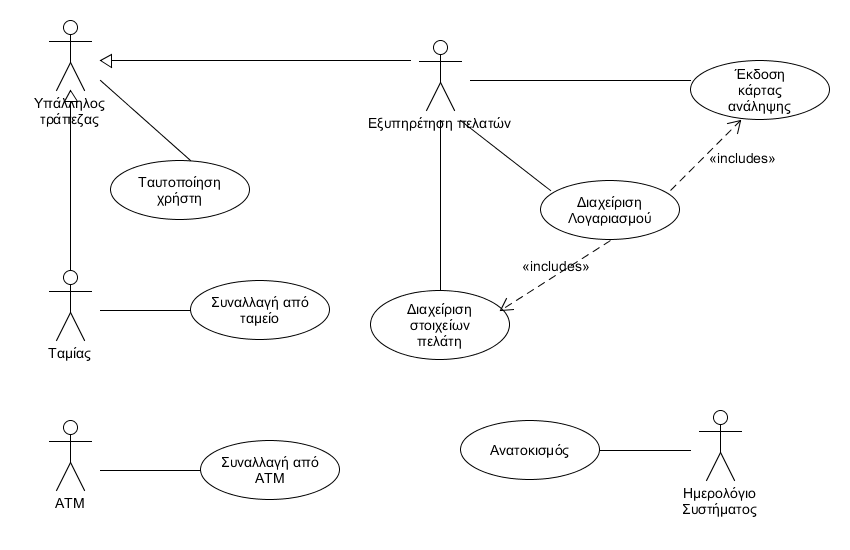

\[*Παρακάτω δίνεται μία περιγραφή του περιεχομένων του Εγγράφου Προδιαγραφών Απαιτήσεων Λογισμικού (ΕΠΑΛ) που βασίζεται σε πρότυπο περιπτώσεων χρήσης. Για κάθε ενότητα του εγγράφου γίνεται παραπομπή σε παραδείγματα του βιβλίου “Μ Γιακουμάκης, Ν. Διαμαντίδης, Τεχνολογία Λογισμικού, Σταμούλης, 2009”. Το παράδειγμα ενός συστήματος Τράπεζας έχει σχεδιαστεί από τον Β.Ζαφείρη στα πλαίσια φροντιστηρίων του μαθήματος Τεχνολογία Λογισμικού του Τμήματος Πληροφορικής του ΟΠΑ.*\]

# Εισαγωγή

\[*Μία εισαγωγή που αφορά το παρόν έγγραφο.*\]

## Εμβέλεια

\[*Περιγράφουμε τι θα κάνει και κυρίως τι δεν θα κάνει το λογισμικό. Βλέπε παράδειγμα 3-2 του βιβλίου στη σελίδα 139.*

*Ένα διάγραμμα περιβάλλοντος (πρωταρχικό διάγραμμα ροής δεδομένων) που βοηθά στην κατανόηση του συστήματος σε σχέση με το περιβάλλον του. Βλέπε το σχήμα 4-12 του παραδείγματος 4-1 στη σελίδα 185 του βιβλίου*\]

## Ορισμοί ακρώνυμα και συντομογραφίες

\[*Ένας πίνακας ακρωνύμων και συντομογραφιών που χρησιμοποιούνται στο έγγραφο. Ένας δεύτερος πίνακας με ορισμούς. Οι ορισμοί λαμβάνονται από το γλωσσάρι αν αυτό υπάρχει. Βλέπε πίνακα 3-5 του παραδείγματος 3-1 στη σελίδα 134.*\]

## Αναφορές

\[*Γράφουμε αν υπάρχουμε αναφορές σε άλλα έγγραφα (μελέτη σκοπιμότητας, ΕΠΑΣ, επιχειρησιακά μοντέλα κλπ). Σε περίπτωση που κάποια πληροφορία περιλαμβάνεται σε άλλο έγγραφο γίνεται η αναφορά στο άλλο έγγραφο και δεν επαναλαμβάνεται στο ΕΠΑΛ).*\]

## Επισκόπηση

\[*Γράφουμε πως οργανώνεται το υπόλοιπο έγγραφο*\]

# Συνολική περιγραφή

## Επισκόπηση μοντέλου περιπτώσεων χρήσης

\[*Εισάγουμε το διάγραμμα περιπτώσεων χρήσης. Βλέπε σχήμα 3-19 του παραδείγματος 3-11 στη σελίδα 168 του βιβλίου.*

*Εισάγουμε έναν πίνακα με τους κωδικούς, τους τίτλους και μία σύντομη περιγραφή των περιπτώσεων χρήσης. Βλέπε πίνακα 3-8 του παραδείγματος 3-11 στη σελίδα 168 του βιβλίου*\]

## Υποθέσεις και εξαρτήσεις

\[*Γράφουμε τις υποθέσεις που κάνουμε και τις εξαρτήσεις του συστήματος σε σχέση με το περιβάλλον του.*\]

# Ειδικές Απαιτήσεις 

## Περιπτώσεις χρήσης

### Οι ενδιαφερόμενοι και οι ανάγκες τους

\[*Ένας πίνακας των ενδιαφερομένων (stakeholders) με τις ανάγκες τους. Βλέπε πίνακα 3-6 του παραδείγματος 3-2 στη σελίδα 138 του βιβλίου.*\]

### Actors του συστήματος

\[*Ένα πίνακας με του actors του συστήματος. Βλέπε πίνακας 3-7 παραδείγματος 3-11 στη σελίδα 167 του βιβλίου.*\]

### Περιγραφές περιπτώσεων χρήσης

\[*Γράφονται οι περιπτώσεις χρήσης οι οποίες συνοδεύονται με διαγράμματα δραστηριότητας εάν θεωρηθεί αναγκαίο.*

*Βλέπε , το παράδειγμα 3-7 στη σελίδα 159, το παράδειγμα 3-8 στη σελίδα 160 και το παράδειγμα 3-9 στη σελίδα 162.*\]

#### [ΠΧ1 Συναλλαγή από ταμείο](uc1-cashier-transactions.md)

#### [ΠΧ2 Διαχείριση Λογαριασμού](uc2-account-management.md)

#### [ΠΧ3 Διαχείριση Στοιχείων Πελάτη](uc3-client-management.md)

#### [ΠΧ4 Έκδοση κάρτας ανάληψης](uc4-debit-card-management.md)

#### ΠΧ5 Ανατοκισμός

#### ΠΧ6 Συναλλαγή από ΑΤΜ

#### ΠΧ7 Ταυτοποίηση Χρήστη

## Συμπληρωματικές προδιαγραφές

\[*Οι επόμενες ενότητες περιέχουν όλες τις μη λειτουργικές απαιτήσεις και τους περιορισμούς σχεδίασης και υλοποίησης.*\]

### Απαιτήσεις διεπαφών

#### Διεπαφές χρήστη

\[*Βλέπε πίνακα 5-2 του παραδείγματος 5-1 στη σελίδα 305*\]

#### Διεπαφές υλικού

\[*Βλέπε πίνακα 5-2 του παραδείγματος 5-1 στη σελίδα 305*\]

#### Διεπαφές επικοινωνίας

\[*Βλέπε πίνακα 5-2 του παραδείγματος 5-1 στη σελίδα 305*\]

#### Διεπαφές λογισμικού

\[*Βλέπε πίνακα 5-2 του παραδείγματος 5-1 στη σελίδα 305*\]

### Περιορισμοί σχεδίασης και υλοποίησης

\[*Βλέπε πίνακα 5-3 του παραδείγματος 5-1 στη σελίδα 305*\]

### Ποιοτικά χαρακτηριστικά

#### Απόδοση

\[*Βλέπε πίνακα 5-4 του παραδείγματος 5-1 στη σελίδα 306*\]

#### Διαθεσιμότητα

\[*Βλέπε πίνακα 5-4 του παραδείγματος 5-1 στη σελίδα 306*\]

#### Ασφάλεια

\[*Βλέπε πίνακα 5-4 του παραδείγματος 5-1 στη σελίδα 306*\]

#### Ευελιξία

\[*Βλέπε πίνακα 5-4 του παραδείγματος 5-1 στη σελίδα 306*\]

#### Ευχρηστία

\[*Βλέπε πίνακα 5-4 του παραδείγματος 5-1 στη σελίδα 306*\]

# Υποστηρικτικό υλικό

## Μοντέλο πεδίου

\[*Εισάγουμε το μοντέλο πεδίου του συστήματος. Βλέπε σχήμα 4-100 του παραδείγματος 4-13 στη σελίδα 251 του βιβλίου*\]

## Ανάλυση περιπτώσεων χρήσης
--------------------------

### Κλάσεις ανάλυσης

\[*Εισάγουμε ένα διάγραμμα κλάσεων με την αρχική έκδοση των κλάσεων λογισμικού. Βλέπε σχήμα 4-104 του παραδείγματος 4-14 στη σελίδα 258 του βιβλίου*\]

Κλάσεις ανάλυσης που έχουν προκύψει από την ανάλυση των περιπτώσεων χρήσης *Διαχείριση Λογαριασμού* και *Διαχείριση Στοιχείων Πελάτη*.

### Συμπεριφορές

\[*Για κάθε σημαντική περίπτωση χρήσης εισάγουμε ένα διάγραμμα κλάσεων με τις κλάσεις που συμμετέχουν στη συμπεριφορά του συστήματος για την περίπτωση χρήσης. Το σημαντικότερο όμως είναι ένα διάγραμμα επικοινωνίας ή ακολουθίας που δείχνει την ανταλλαγή μηνυμάτων.*

*Βλέπε το παράδειγμα 4-16 στη σελίδα 262 του βιβλίου*\]

#### Άνοιγμα νέου λογαριασμού

#### Ανάληψη μετρητών από ταμείο

## Άλλα μοντέλα
------------

\[*Άλλα μοντέλα όπως για παράδειγμα διαγράμματα μηχανής καταστάσεων, πίνακες απόφασης κλπ. Βλέπε παράδειγμα 4-6 του βιβλίου*\]

## Επιχειρησιακοί κανόνες

\[*Ένας πίνακας με του επιχειρησιακούς κανόνες. Βλέπε πίνακα 3-4 του παραδείγματος 3-1 στη σελίδας 133 του βιβλίου.*\]

| Επιχειρησιακοί κανόνες | Περιγραφή |
| :----------------------| :---------|
| ΕΚ1 | O Αριθμός Δελτίου Ταυτότητας και το ΑΦΜ είναι μοναδικά για κάθε πελάτη 
| ΕΚ2 | Όλα τα στοιχεία του πελάτη είναι υποχρεωτικά, με εξαίρεση τον αριθμό Fax
| ΕΚ3 | Η ηλικία του πελάτη θα πρέπει να είναι μεγαλύτερη των 18 ετών