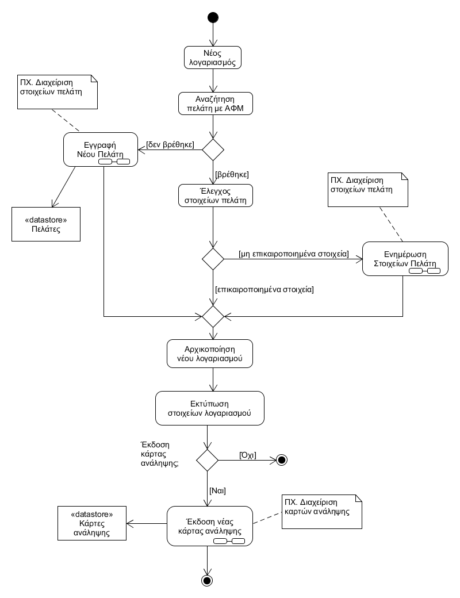

# ΠΧ2. Διαχείριση Λογαριασμού

**Πρωτεύων Actor**: Εξυπηρέτηση πελατών  
**Ενδιαφερόμενοι**
**Εξυπηρέτηση πελατών**: Θέλει να προσθέσει νέους πελάτες στην τράπεζα.  
**Πελάτης**: Θέλει να έχει πρόσβαση στις υπηρεσίες της τράπεζας.  
**Προϋποθέσεις**: Ο υπάλληλος εξυπηρέτησης πελατών έχει ταυτοποιηθεί για την πρόσβασή του στο σύστημα.

## Βασική Ροή

### Α) Άνοιγμα Λογαριασμού
1. Ο υπάλληλος επιλέγει τη δημιουργία νέου λογαριασμού πελάτη.
2. Ο υπάλληλος αναζητά τον πελάτη βάσει ΑΦΜ.
3. Το σύστημα εμφανίζει τα στοιχεία του πελάτη.
4. Ο υπάλληλος επιβεβαιώνει ότι τα στοιχεία του πελάτη είναι επικαιροποιημένα
5. Το σύστημα παράγει νέο αριθμό λογαριασμού, τον αρχικοποιεί με μηδενικό υπόλοιπο και εισάγει την τρέχουσα ημερομηνία ως ημερομηνία ανοίγματος.
6. Το σύστημα εκτυπώνει τα στοιχεία του λογαριασμού.
7. [Ο υπάλληλος εκδίδει νέα κάρτας ανάληψης για το λογαριασμό](uc4-debit-card-management.md "Συμπερίληψη σεναρίου χρήσης [ΠΧ Έκδοση Κάρτας Ανάληψης]/[Έκδοση νέας κάρτας ανάληψης]").

## Εναλλακτικές Ροές

*3α. Ο πελάτης δεν είναι εγγεγραμμένος στο σύστημα*
1. [Ο υπάλληλος εγγράφει τον πελάτη](uc3-client-management.md "Συμπερίληψη σεναρίου χρήσης [ΠΧ Διαχείριση Στοιχείων Πελάτη]/[Εγγραφή Νέου Πελάτη]") 
   * *2.α Δεν είναι δυνατή η εγγραφή του πελάτη*
        1. Η περίπτωση χρήσης τερματίζει.
2. Η περίπτωση χρήσης επιστρέφει στο βήμα 5 της βασικής ροής
   
*4α. Τα στοιχεία του πελάτη χρειάζονται επικαιροποίηση*
1. [Ο υπάλληλος ενημερώνει τα στοιχεία του πελάτη](uc3-client-management.md "Συμπερίληψη σεναρίου χρήσης [ΠΧ Διαχείριση Στοιχείων Πελάτη]/[Ενημέρωση Στοιχείων Πελάτη]")
2. Η ΠΧ επιστρέφει στο βήμα 5 της βασικής ροής
	
*7α. Ο πελάτης δεν επιθυμεί την έκδοση κάρτας ανάληψης*
1. Η ΠΧ τερματίζει

### Β) Κλείσιμο λογαριασμού

\[*Περιγραφή σεναρίου χρήσης.*\]

## Διαγράμματα

### Διάγραμμα δραστηριότητας - Άνοιγμα νέου λογαριασμού

